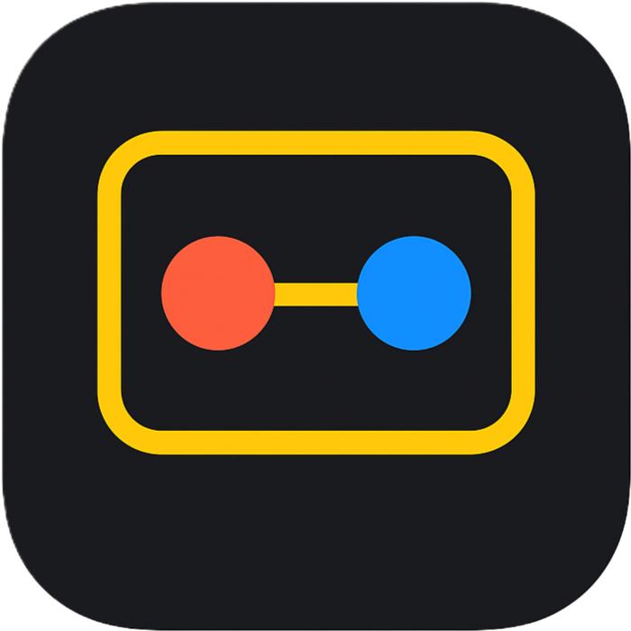

# Loops & Squares

Real-time multiplayer Dots-and-Boxes built with Next.js, Tailwind CSS, and Socket.IO. Create a username, challenge other players in the lobby, and claim the most squares to win.



---

## Contents

- [Overview](#overview)
- [Features](#features)
- [Tech Stack](#tech-stack)
- [Architecture](#architecture)
- [Getting Started](#getting-started)
  - [Prerequisites](#prerequisites)
  - [Environment Variables](#environment-variables)
  - [Install & Run](#install--run)
  - [Quality Checks](#quality-checks)
- [Game Flow](#game-flow)
- [Backend Contracts](#backend-contracts)
- [Project Structure](#project-structure)
- [Build & Deployment](#build--deployment)
  - [Web](#web)
  - [Android (Capacitor)](#android-capacitor)
- [Testing](#testing)
- [Contributing](#contributing)
- [Roadmap Ideas](#roadmap-ideas)
- [Community](#community)
- [License](#license)

---

## Overview

Loops & Squares turns classic pen-and-paper Dots-and-Boxes into a sleek online experience. Players can:

- Register with a unique username to enter the shared lobby.
- See who is online in real time, send match requests, and accept incoming challenges.
- Vote on the grid size before a match starts, then race to complete the most squares.
- Enjoy a responsive, mobile-friendly interface that transitions seamlessly to a Capacitor-powered Android build.

The frontend lives in this repository. It relies on a companion Socket.IO backend that tracks sessions, matchmaking, and game state.

## Features

- **Instant lobby presence** – usernames are validated and synced in real time so you always know who is available to play.
- **Challenge-based matchmaking** – invite a player directly from the lobby; both socket events and REST endpoints cooperate to start the game.
- **Dynamic grid selection** – first player to respond chooses from multiple grid sizes (4x4 up to 8x8) before the match begins.
- **Animated Dots & Boxes board** – modern UI with turn indicators, score tracking, and celebratory modals for wins, losses, and ties.
- **Session resilience** – reconnect logic keeps players in their original game if the browser tab reloads.
- **Android packaging** – Capacitor tooling and an Android project are ready for native builds; a debug APK is already included for quick installs.

## Tech Stack

- **Framework**: Next.js 15 (App Router) with React 19.
- **Styling**: Tailwind CSS and custom animations.
- **Real-time transport**: Socket.IO client.
- **State & utilities**: React hooks, UUID session IDs, Lucide icons.
- **Native wrapper**: Capacitor 7 with Android target.

## Architecture

- `src/app` contains the App Router pages:
  - `page.tsx` handles username registration and lobby entry checks.
  - `lobby/page.tsx` renders online players, matchmaking controls, and profile drawer.
  - `game/page.tsx` orchestrates the Dots-and-Boxes gameplay loop.
- `src/lib/socket.ts` wraps Socket.IO connections, attaching the current session ID before connecting.
- The backend (external service) stores session metadata, enforces username uniqueness, broadcasts lobby state, and emits game room updates.
- Capacitor builds bundle the static export produced by Next.js into the Android project under `android/`.

## Getting Started

### Prerequisites

- Node.js **20.x** or newer.
- npm **10.x** (ships with Node 20). Yarn/pnpm/bun also work if you prefer.
- A running Socket.IO backend that conforms to the [Backend Contracts](#backend-contracts).

### Environment Variables

Create a `.env.local` file at the repository root:

```bash
NEXT_PUBLIC_BACKEND_URL=http://localhost:4000
```

`NEXT_PUBLIC_BACKEND_URL` must point to the backend service that exposes both REST and Socket.IO endpoints.

### Install & Run

```bash
# Install dependencies
npm install

# Start the frontend in dev mode
npm run dev

# In another terminal, ensure the backend is running
# (see Backend Contracts for required endpoints/events)

# Visit the app
open http://localhost:3000
```

Hot reload is enabled. Edits to any file in `src/app` will refresh the browser automatically.

### Quality Checks

Run the provided Next.js lint rules:

```bash
npm run lint
```

No automated tests exist yet (see [Testing](#testing)), so linting and manual gameplay are the primary checks.

## Game Flow

1. **Register** – Enter a username on the home page. It is validated via `POST /api/user/checkUsername`. On success, a UUID session ID is created and attached to the socket auth payload.
2. **Lobby** – Join the shared lobby where you can refresh the player list, issue challenges, and accept requests.
3. **Matchmaking** – When two players connect, the backend creates a room and requests a grid size. Only one selection is accepted.
4. **Play** – Players alternate drawing lines between adjacent dots. Completing a square grants a point and another turn.
5. **Finish** – Once all squares are claimed, the backend sends a final state with the winner or tie and the UI shows a modal with next steps.

## Backend Contracts

The frontend expects the backend to provide:

### REST Endpoints

- `POST /api/user/checkUsername` → validates a username. Returns `200` if available, `409` (or any non-OK) if taken.
- `GET /api/user/onlineUsers` → returns an array of `{ socketId, username, sessionId }` for lobby display.
- `POST /api/user/requests` → with JSON `{ sessionId }` and `Authorization: Bearer <sessionId>` header. Returns pending friend/match requests.

### Socket Events

- Client emits `join`, `leave`, `sendFriendRequest`, `friendRequestAccepted`, `checkActiveRoom`, `selectGridSize`, `makeMove`, `leaveGame`.
- Server emits `onlineUsers`, `receiveFriendRequest`, `gameStart`, `activeRoom`, `gameStateUpdate`, `playerRoleAssigned`, `connectionMade`, `gridSizeSelected`, `userLeft`, and `gameFinished`.

Adjust your backend to honor these contracts or adapt the frontend accordingly.

## Project Structure

```
.
├── src/
│   ├── app/
│   │   ├── page.tsx          # Registration and lobby entry
│   │   ├── lobby/page.tsx    # Real-time lobby & matchmaking
│   │   └── game/page.tsx     # Dots-and-Boxes gameplay
│   └── lib/socket.ts         # Socket.IO client abstraction
├── public/                   # PWA manifest and static assets
├── android/                  # Capacitor Android wrapper project
├── apk/app-debug.apk         # Prebuilt debug APK for quick installs
├── capacitor.config.ts       # Capacitor build configuration
└── package.json              # Scripts & dependencies
```

## Build & Deployment

### Web

```bash
# Production build
npm run build

# Start the production server
npm run start

# (Optional) Static export for Capacitor
npm run export
```

Deploy the `.next` build output to any Node hosting provider (Vercel, Render, etc.). If you need a static bundle (e.g., for embedding in Capacitor), use `npm run export` to generate the `out/` directory.

### Android (Capacitor)

The Android project lives under `android/` and is already synchronized with Capacitor config. To refresh the native build:

```bash
# Ensure fresh web assets
npm run build
npm run export

# Copy assets into the native project
npx cap sync android

# Open Android Studio
npx cap open android
```

A debug build is available at `apk/app-debug.apk` for quick sideloading.

## Testing

Automated tests have not been implemented yet. Recommended next steps:

- Add component-level tests with React Testing Library for key UI flows.
- Add integration tests covering socket events with a mocked backend.
- Consider Playwright or Cypress for end-to-end matchmaking scenarios.

## Contributing

Contributions of all sizes are welcome! To contribute:

1. Fork the repository and create a feature branch: `git checkout -b feature/amazing-idea`.
2. Install dependencies and run `npm run dev` to reproduce the environment.
3. Add or update code, including documentation and tests where applicable.
4. Ensure `npm run lint` passes.
5. Submit a pull request describing the motivation, changes, and testing performed.

Please follow conventional commit messages if possible (e.g., `feat: add rematch button`). Feel free to open an issue first if you want feedback on direction before implementation.

## Roadmap Ideas

- Spectator mode with live game viewer.
- Ranked matchmaking and ELO-based leaderboards.
- Persistent profiles backed by Redis or another store.
- In-game chat or reactions.
- Progressive Web App enhancements (offline caching, push notifications).

## Community

- **Issues**: Use GitHub Issues for bugs, feature requests, or questions.
- **Discussions**: Start a discussion thread for brainstorming or design proposals.
- **Security**: Please report vulnerabilities privately to the maintainers before disclosing publicly.

## License

This project is intended to be released under the MIT License. Add a `LICENSE` file before publishing to ensure contributors understand the exact terms.

---

Enjoy the game, and thanks for helping Loop & Squares grow!
